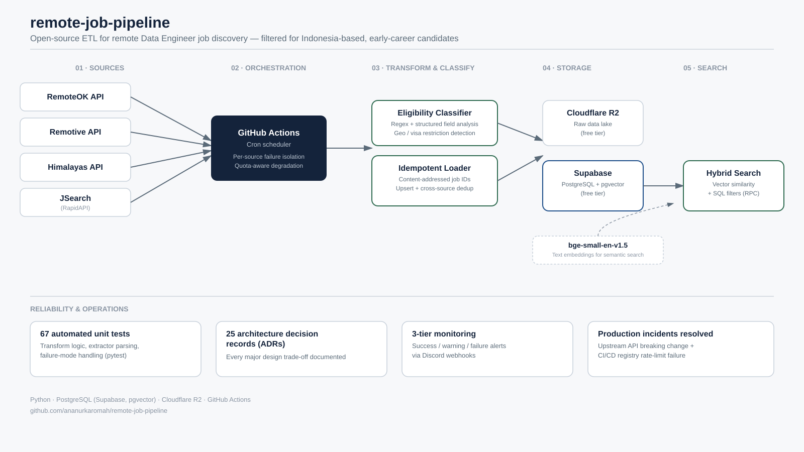

# Architecture

> Status: design document, written ahead of implementation. Module names follow the repository layout in the README.

## 1. Purpose and scope

`remote-job-pipeline` is an automated ETL pipeline that collects **remote Data Engineer job postings** from several sources, keeps only those that an **Indonesia-based, early-career candidate** can realistically apply to, enriches and vectorizes them, and stores them so that an AI agent can run **hybrid search** (SQL filters + semantic vector search).

### Goals

- Surface remote Data Engineer / ETL Developer roles that are open to candidates in Indonesia.
- Restrict results to junior-level roles (under 3 years of required experience).
- Keep only postings from the **last 7 days**.
- Run unattended on a schedule, safely re-runnable (idempotent), and fail loudly instead of silently.
- Stay within free tiers (GitHub Actions, Cloudflare R2, Supabase), with no dependency on a billing account or credit card for the raw-data layer.

### Non-goals

- Scraping sites that prohibit it (see `docs/decisions.md`, ADR-001).
- Full-history analytics of the job market. Only a rolling 7-day window is kept.
- Auto-applying to jobs. The pipeline only produces a searchable list.

## 2. High-level flow



```text
GitHub Actions (cron) -> docker run rjp
        |
        v
[1] EXTRACT   remoteok | remotive | himalayas | jsearch (quota-aware)
        |     each extractor raises on failure -> SourceResult per source
        v
[2] GUARDS    all sources failed -> notify_failure, exit 1
        |     no jobs at all     -> notify_warning, exit 0 (no writes)
        v
[3] RAW LAKE  R2: raw-data/year=YYYY/month=MM/day=DD/jobs.json  (unfiltered)
        |
        v
[4] TRANSFORM (per-job try/except; failures counted, not fatal)
        |     clean -> recency (7d) -> role -> seniority -> eligibility
        |     -> salary -> tech stack -> normalization
        |     rejected jobs + reason codes -> R2 rejected-data/
        v
[5] DEDUP     new batch + existing 7-day rows -> one most-complete winner per job
        v
[6] EMBED     SentenceTransformers bge-small-en-v1.5 (384 dimensions), winners only
        v
[7] SERVE     Supabase PostgreSQL + pgvector: idempotent upsert, retention cleanup
        v
[8] MONITOR   Discord summary (success / warning / failure)

AI agent -> search_jobs() RPC -> SQL filters + cosine similarity
```

## 3. Components

### 3.1 Orchestrator (`main.py`)

Single entry point run inside the container. Responsibilities:

- Build the list of extractors and call `extract_all_sources()`.
- Apply guard clauses (section 6).
- Call load, transform, dedup, embed, and serve stages in order.
- Build a `RunSummary` and send exactly one Discord notification per run.
- Return exit code `0` (success or warning) or `1` (total failure).

### 3.2 Extract (`extract/`)

| Source | Type | Notes |
|---|---|---|
| RemoteOK | Public JSON API | Attribution may be required. Fully filtered locally. |
| Remotive | Public API | Category and location fields help eligibility. |
| Himalayas | API / feed | Structured location restrictions. |
| JSearch (RapidAPI) | Aggregator API | Small free quota, so it is quota-aware (section 3.2.1). Keeps `origin_portal` (the publisher) separate from `source`. |
| Glints ID / Jobstreet | Selenium scraper | **Out of the default pipeline** (ADR-022). Lives under `extract/experimental/`, disabled by default. |

**Extractor contract**

- An extractor **raises `ExtractionError`** on any failure. It never swallows errors and returns `[]`.
- An empty list means "the source is healthy and has no matching data".
- Response shape is validated at the extractor boundary. An HTTP 200 whose body has changed shape raises `PARSE`.
- Retries (max 3, exponential backoff) apply only to transient errors (timeouts, 429, 5xx). `AUTH` and `QUOTA` failures are not retried.

`extract_all_sources()` returns one `SourceResult` per source (`status`, `jobs`, `error`, `duration_s`), so a failure is always attributed to a named source and a reason. `status` is one of `ok`, `skipped`, `degraded`, or `failed`.

#### 3.2.1 Quota-aware sources and graceful degradation

Rate-limited third-party APIs (JSearch first) must never take the pipeline down. Rules:

- **Budget before calling.** Each quota-limited extractor has a per-run request cap (for example `JSEARCH_MAX_REQUESTS_PER_RUN`) and can be scheduled on selected days only (`JSEARCH_RUN_DAYS`). If the provider returns remaining-quota headers, the extractor reads them and stops before the reserve is exhausted *(verify the header names in the provider's documentation)*.
- **`skipped` is intentional and is not a failure.** Not scheduled today, below the quota reserve, or already extracted successfully today (found in the R2 run envelope, so a manual re-run never burns quota again). It appears in the Discord summary as `jsearch skipped (reason)` and triggers no warning.
- **`degraded` keeps partial data.** If the first query succeeds and a later one hits HTTP 429, the extractor raises `PartialExtractionError(reason=QUOTA, jobs=[...])`. The registry keeps the jobs already fetched and marks the source `degraded`, which produces a warning but not a failure.
- **`failed` when nothing usable was obtained** (for example quota already exhausted on the first call). The run continues with the other sources and sends a warning.
- **Only total failure is fatal.** Because failures are isolated per source, an exhausted JSearch quota alone can never crash the run.

Extractor contract refinement: an extractor still never swallows errors. It either returns a list (possibly empty), raises `ExtractionError`, or raises `PartialExtractionError` carrying the jobs collected so far.

### 3.3 Raw data lake (`load/r2.py`)

Cloudflare R2 (S3-compatible object storage, accessed with `boto3`), chosen over Google Cloud Storage because it needs no billing account or credit card for its free tier (ADR-025), partitioned by date:

```text
raw-data/year=2026/month=09/day=29/jobs.json
raw-data/year=2026/month=09/day=29/jobs.<run_id>.partial.json   # partial runs only
rejected-data/year=2026/month=09/day=29/rejected.json
```

- `jobs.json` is a run envelope: `run_id`, `extracted_at`, per-source status and counts, and the raw `jobs`.
- Raw data is **not filtered**. If rules change, `scripts/reprocess_from_r2.py` rebuilds everything without calling the APIs again.
- Writes are overwrite-by-partition (idempotent). An empty result never overwrites an existing good file, and a partial run writes a separate `.partial.json`.

### 3.4 Transform (`transform/`)

Every function is pure (no I/O) and individually unit-tested.

| Step | Module | Output |
|---|---|---|
| Cleaning | `cleaning.py` | HTML stripped, unicode and whitespace normalized |
| Normalization | `normalization.py` | `company_norm`, `title_norm`, canonical URL |
| Recency | `pipeline.py` | Drop postings older than `WINDOW_DAYS` (7) |
| Role filter | `role_filter.py` | `role_match` (`core` / `adjacent`), drop non-DE roles |
| Seniority | `role_filter.py` | Drop senior titles and any requirement of 3+ years |
| Eligibility | `eligibility.py` | `eligibility_status`, `eligibility_confidence`, `eligibility_evidence` |
| Salary | `salary.py` | `salary_status`, optional `min/max_salary_usd` |
| Tech stack | `tech_stack.py` | Normalized skill list (Python, SQL, Airflow, Spark, ...) |

Filter order goes from cheapest and most decisive to most expensive, so that embedding cost is only paid for jobs that survive.

**Per-job isolation.** Each job is transformed inside its own `try/except`. The error label is only read with `.get()` after `isinstance(job, dict)`, because a fully corrupt job (for example `None`) would otherwise raise a second exception inside the handler and hide the original error. After the loop the pipeline logs `X/Y job(s) failed transformation and were skipped`, and the count is included in the Discord message. If the failure ratio exceeds a configured threshold (default 30%), the run is treated as a failure, since that usually means a source changed its format.

### 3.5 Deduplication (`transform/dedup.py`)

Runs after transform (needs normalized fields) and before embedding (saves compute).

1. Same canonical URL: duplicate.
2. Same `company_norm` + `title_norm`: candidate duplicate.
3. Same `company_norm`, fuzzy title match, and description similarity above threshold: candidate duplicate.

Candidates must also pass a description check when both descriptions exist, so that the same title at the same company in different regions is **not** merged. Within each cluster a single winner is chosen by a deterministic total order: completeness score, source priority, most recent `posted_at`, then `job_id`. Losers are not stored in `jobs`; they are written to `rejected-data/` with `duplicate_of`. Thresholds are conservative: a missed duplicate is preferred over losing a valid job.

### 3.6 Embedding (`embed/`)

- Model: `BAAI/bge-small-en-v1.5` via SentenceTransformers, 384 dimensions.
- Text template (fields omitted when unknown, salary omitted when not disclosed):

```text
Title: <title>
Company: <company>
Remote Policy: <remote_policy>
Tech Stack: <comma separated>
Salary: <only if disclosed>
Description: <cleaned description>
```

- Query-side embeddings use the model's retrieval instruction prefix; documents do not.
- The exact embedded text is stored in `embedding_text` for debugging.

### 3.7 Serving layer (Supabase)

PostgreSQL with `pgvector`. One `jobs` table keeps metadata next to the vector so filters and similarity run in one query.

| Column group | Columns |
|---|---|
| Identity | `job_id` (PK), `source`, `origin_portal`, `external_id`, `url`, `is_direct_apply_url` |
| Content | `title`, `company`, `description_clean`, `posted_at` |
| Role | `role_match`, `seniority_level`, `min_years_required`, `role_evidence` |
| Eligibility | `eligibility_status`, `eligibility_confidence`, `eligibility_evidence`, `timezone_hint`, `is_eligible_for_id` (generated) |
| Salary | `salary_status`, `min_salary_usd`, `max_salary_usd`, `salary_period`, `salary_raw` |
| Skills | `tech_stack` (text array) |
| Dedup | `company_norm`, `title_norm`, `completeness_score` |
| Vector | `embedding vector(384)`, `embedding_text` |
| Housekeeping | `first_seen_at`, `last_seen_at`, `raw_object_path` |

Indexes: HNSW on `embedding` (cosine), GIN on `tech_stack`, B-tree on `(eligibility_status, posted_at)` and `(company_norm, title_norm)`.

**Hybrid search.** The agent calls the `search_jobs()` SQL function with a query embedding and optional filters:

- `eligibility_levels` (default `{eligible, unknown}`; `restricted` hidden unless requested)
- `required_skills`
- `min_salary` with `include_undisclosed` (default true), so missing salary never hides a job
- `match_count`

Retention: rows whose `posted_at` is older than 7 days are removed at the end of each run.

## 4. Eligibility model (Indonesia)

Three states with confidence and evidence, evaluated from the most to the least reliable source of evidence:

1. Structured API fields
2. Title and tags
3. Description text (regex)

| Status | Meaning |
|---|---|
| `eligible` | Explicit evidence the role is open to Indonesia (worldwide, anywhere, APAC, Asia, ASEAN, Indonesia) |
| `restricted` | Explicit evidence of another region (US only, EU residents, authorized to work in the US, a country list without Indonesia) |
| `unknown` | No evidence, or conflicting evidence (kept, not dropped) |

Timezone overlap requirements are stored as `timezone_hint` and do not change the status.

## 5. Idempotency guarantees

- `job_id = sha256(source:external_id)` (or normalized URL when no external id exists).
- Database writes use `INSERT ... ON CONFLICT (job_id) DO UPDATE`.
- R2 partitions are overwritten, never appended.
- Dedup winner selection is a deterministic total order, so the same input always yields the same winner.
- Winner replacement (different `job_id`) deletes the old row and upserts the new one in one transaction.
- The workflow uses a `concurrency` group so two runs never overlap.
- Running the pipeline twice on the same data must produce an identical database state (covered by `tests/integration/test_idempotency.py`).

## 6. Failure handling

| Condition | Behavior | Discord | Exit code |
|---|---|---|---|
| All sources ok, data present | Continue | Success | 0 |
| Some sources failed | Continue with remaining data, attribute each failure | Warning | 0 |
| All sources failed | Stop | Failure | 1 |
| All sources ok, zero jobs extracted | Early return, no writes | Warning: "verify this is expected" | 0 |
| Jobs extracted, zero survive filtering | Early return before embedding and load | Warning: "verify this is expected" | 0 |
| Transform failure ratio above threshold | Stop | Failure | 1 |

The guard clauses avoid calling `load_raw_to_r2([])` and `load_to_supabase([])`. Warning wording is deliberately neutral so that repeated warnings act as a signal to check manually rather than being read as normal.

## 7. Monitoring

One Discord message per run, built from a single `RunSummary`:

```text
[OK]   run 2026-09-29 | extracted 118 (remoteok 61, remotive 34, jsearch 23)
       dropped: 41 non-DE role, 33 senior / 3+ yrs, 12 duplicates
       loaded 32 (eligible 14, unknown 16, restricted 2)
       (2 skipped due to transform errors)

[WARN] source jsearch FAILED: quota. Continuing with 2/3 sources.
       0 jobs loaded, verify this is expected.

[FAIL] all sources failed: remoteok=network, remotive=network, jsearch=auth
```

Messages are sent as Discord embeds whose color encodes urgency: green for success (`0x2ECC71`), yellow for warning or degraded (`0xF1C40F`), red for failure (`0xE74C3C`). The color follows the same classification as the exit code: success and warning exit `0`, only total failure exits `1`.

Notification helpers never raise: they use a short timeout and log locally if Discord itself is unreachable. Logs use structured `source=` and `run_id=` fields so any failure points to a specific source.

Quality metrics tracked over time: unknown-eligibility rate, salary-disclosure rate per source, duplicates removed per source, skipped-transform count.

## 8. Security

- No secrets in the repository. Configuration comes from environment variables (`.env.example` lists them) and GitHub Actions secrets.
- The R2 API token is scoped to a single bucket with object read/write permission only, created without any billing account or payment method attached.
- Least-privilege database roles: the pipeline connects as `pipeline_writer` (read/write on `jobs` only), and the AI agent connects as `agent_readonly` (select and `search_jobs()` only, read-only transactions, statement timeout). The admin credential is used only locally for migrations and is never stored in GitHub. Row-level security is enabled on `jobs` so the public REST API cannot read or write it. Details in `docs/deployment.md`.
- The container runs without extra privileges and is removed after each run.

## 9. Testing and evaluation

- **Unit tests** for every transform function, including boundary cases (for example, `Corporate` must not trigger the `rate` salary keyword).
- **Contract tests** verify that extractors raise on failure and that an empty list is not treated as a failure.
- **Labeled sets** in `tests/labeled/` (eligibility, role, dedup pairs) feed `scripts/evaluate.py`, which reports precision, recall, and confusion matrices.
- Primary metrics: precision of `eligible`, recall of `restricted`, recall of relevant roles, precision of dedup merges.
- **Integration test** confirms idempotency by running the pipeline twice.

## 10. Scalability notes

- Current volume is hundreds of rows per week. Loads are single-request.
- `load_raw_to_r2` and `load_to_supabase` carry a FUTURE-PROOFING note: when volume reaches the thousands, batch uploads (for example 500 rows per request) and batch embeddings.
- Dedup blocks on `company_norm`, avoiding all-pairs comparison.

## 11. Future work

- More sources (Himalayas, JSearch, then a regional scraper).
- Optional field merging across duplicates.
- LLM fallback only for `unknown` eligibility, with rules kept as the baseline.
- AI agent on Databricks, in one of three ways (see `docs/databricks_roadmap.md`):
  1. Agent calls `search_jobs()` on Supabase as a tool.
  2. Raw lake (in R2) loaded into Delta tables with Databricks Vector Search (medallion layout).
  3. Serving layer moved to Lakebase (Postgres + pgvector). The schema is portable because it is plain Postgres.
- Keeping the `load/` layer separate from `transform/` and `embed/` means a serving-layer change touches only `load/`.
